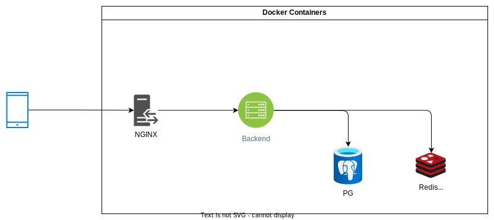

# Amazing Digital Template


## Архитектура решения
- [Сайт](locahost) решения
- Сваггер [документация](locahost/api/docs)

### Диаграмма решения

Все компаненты контейнерезированы:
- `nginx` - Reverse-proxy, роутинг, SSL
- `frontend` - React SPA приложение для фронтенда
- `backend` - Python backend, использует `fastapi`, `uvicorn`, `sqlalchemy`, `pydantic`
- `redis` - Key-value СУБД
- `postgres` - Реляционая СУБД

#### Запуск решения
##### В докере
C ssl
```sh
docker compose up # С SSL
```
Без ssl
```sh
docker compose -f docker-compose-nossl.yaml up
```
Локально
```sh
make frontend-install

make backend-install

make infra-run

make frontend-run # В отдельном терминале

make backend-run # В отдельном терминале
```

### Линтинг
Установка
```bash
pre-commit install
```
Запуск
```bash
make lint
```

### Устройство проекта
- docs - схемы, документации, туториалы
- backend - бекенд
- frontend - фронтенд
- volumes - томы для docker, а именно для pg, redis
- pg - файлы инициализации для pg
- nginx - файлы конфигурации для nginx
